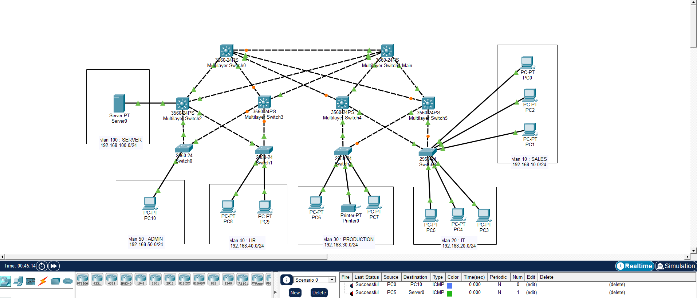

𝐄𝐧𝐭𝐞𝐫𝐩𝐫𝐢𝐬𝐞-𝐅𝐚𝐜𝐭𝐨𝐫𝐲-𝐍𝐞𝐭𝐰𝐨𝐫𝐤-𝐋𝐚𝐛

𝐇𝐢𝐠𝐡𝐥𝐢𝐠𝐡𝐭𝐬

- 𝐈𝐧𝐭𝐞𝐫-𝐕𝐋𝐀𝐍 𝐫𝐨𝐮𝐭𝐢𝐧𝐠 𝐮𝐬𝐢𝐧𝐠 𝐒𝐕𝐈 (𝐋𝐚𝐲𝐞𝐫 𝟑 𝐬𝐰𝐢𝐭𝐜𝐡𝐢𝐧𝐠)
- 𝐂𝐞𝐧𝐭𝐫𝐚𝐥𝐢𝐳𝐞𝐝 𝐃𝐇𝐂𝐏 𝐟𝐨𝐫 𝐦𝐮𝐥𝐭𝐢𝐩𝐥𝐞 𝐕𝐋𝐀𝐍𝐬
- 𝐇𝐒𝐑𝐏 𝐟𝐨𝐫 𝐠𝐚𝐭𝐞𝐰𝐚𝐲 𝐫𝐞𝐝𝐮𝐧𝐝𝐚𝐧𝐜𝐲
- 𝐕𝐋𝐀𝐍 𝐬𝐞𝐠𝐦𝐞𝐧𝐭𝐚𝐭𝐢𝐨𝐧 𝐟𝐨𝐫 𝐝𝐞𝐩𝐚𝐫𝐭𝐦𝐞𝐧𝐭𝐚𝐥 𝐢𝐬𝐨𝐥𝐚𝐭𝐢𝐨𝐧
- 𝐏𝐨𝐫𝐭 𝐒𝐞𝐜𝐮𝐫𝐢𝐭𝐲 𝐨𝐧 𝐚𝐜𝐜𝐞𝐬𝐬 𝐥𝐚𝐲𝐞𝐫
- 𝐃𝐇𝐂𝐏 𝐒𝐧𝐨𝐨𝐩𝐢𝐧𝐠 𝐭𝐨 𝐩𝐫𝐞𝐯𝐞𝐧𝐭 𝐫𝐨𝐠𝐮𝐞 𝐬𝐞𝐫𝐯𝐞𝐫𝐬
- 𝐁𝐚𝐬𝐢𝐜 𝐝𝐞𝐯𝐢𝐜𝐞 𝐡𝐚𝐫𝐝𝐞𝐧𝐢𝐧𝐠 (𝐜𝐨𝐧𝐬𝐨𝐥𝐞, 𝐕𝐓𝐘, 𝐞𝐧𝐚𝐛𝐥𝐞 𝐬𝐞𝐜𝐫𝐞𝐭, 𝐩𝐚𝐬𝐬𝐰𝐨𝐫𝐝 𝐞𝐧𝐜𝐫𝐲𝐩𝐭𝐢𝐨𝐧)

𝐃𝐞𝐚𝐭𝐢𝐥𝐬

1. Network Architecture

  Core Layer: 2 Multilayer switches (Layer 3 switching & routing)
  Distribution Layer: Aggregation switches connecting access and core
  Access Layer: Layer 2 switches connecting end devices
  
  The design ensures structured traffic flow, scalability, and separation of responsibilities across layers.

2. VLAN Segmentation

  The network is logically divided into multiple VLANs based on departments:
  
  VLAN 10 – Sales
  VLAN 20 – IT
  VLAN 30 – Production
  VLAN 40 – HR
  VLAN 50 – Admin
  VLAN 100 – Servers
  
  Each VLAN operates as an independent broadcast domain, improving security and network efficiency.

3. Key Configurations
   
  Device Hardening
    Hostname configuration for device identification
    Secured privileged access using enable secret
    Console, AUX, and VTY line passwords configured
    Enabled service password-encryption
    Login authentication enforced on all access lines 
    
  Inter-VLAN Routing (SVI)
    Implemented using Switch Virtual Interfaces (SVI) on core multilayer switches
    Enabled ip routing to allow communication between VLANs
    Each VLAN assigned a dedicated gateway IP
    
  DHCP (Centralized IP Management)
    DHCP configured on core multilayer switch
    Separate DHCP pools for each VLAN
    Automatic IP assignment including gateway and DNS
    
  Port Security (Access Layer)
    Limits number of MAC addresses per port
    Prevents unauthorized device connections
    Sticky MAC learning enabled
    
  DHCP Snooping
    Enabled across all switches
    Protects against rogue DHCP servers
    Trusted ports configured on uplinks
    
  Switching & Connectivity
    Trunk links configured using 802.1Q between switches
    VLAN traffic properly segmented and carried across the network
    Access ports assigned based on departmental VLANs
    
  Testing & Validation
    Verified inter-VLAN communication using ICMP (ping)
    Confirmed DHCP IP assignment across all VLANs
    Validated security features (port restriction and DHCP filtering)
